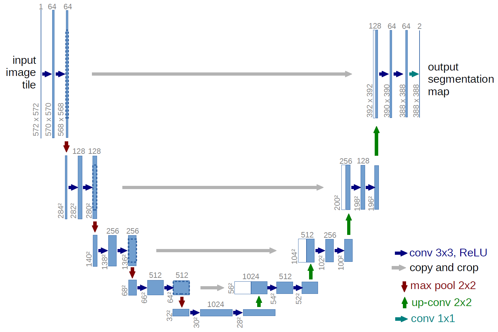

# dl_26_3
# Defect Detection
Детекция дефектов на поверхностях

## Getting started

Requirements

* Python >= 3.7
* GPU >= 16GB
* CUDA >= 11.3

1) Запуск обучения:

````
$ python train_unet.py
````

2) Инференс:

````
$ python inference_unet.py
````

## Dataset
Для обучения использовался набор данных Cracks on the Surface of the Construction (CrackForest Dataset), 
представленный по [ссылке](https://github.com/Charmve/Surface-Defect-Detection#9cracks-on-the-surface-of-the-construction).
Набор данных представляет собой аннотированную базу данных изображений трещин на поверхностях, которая может быть 
использована как представление общего состояние поверхности.

В наборе 11299 цветных изображений поверхностей с трещинами (файлы изображений извлечены на уровне пикселей). 
Датасет был разделен на тестовую и тренировочную выборки в пропорции 80/20.

## Model
Для решения задачи детекции дефектов на поверхности дорожных покрытий была выбрана сверточная нейронная сеть для 
сегментации изображений – U-Net. U-Net считается одной из стандартных архитектур CNN для задач сегментации изображений, 
когда нужно не только определить класс изображения целиком, но и сегментировать его области по классу, т. е. создать 
маску, которая будет разделять изображение на несколько классов. Архитектура состоит из стягивающего пути для захвата 
контекста и симметричного расширяющегося пути, который позволяет осуществить точную локализацию.

<p align="center"></p>

Обе обученные нами модели U-Net используют как основу предобученные resnet и vgg энкодеры. Обученные модели можно 
скачать по [ссылке](https://drive.google.com/drive/folders/16R0bpyHB9yJcPEL2J5yhRG7CfcIYxN1m?usp=sharing).

Характеристики машины, на которой проводилось обучение:
* CPU: AMD Ryzen 9 5900HX 
* GPU: NVIDIA GeForce RTX 3080 
* RAM: 64GB

График потерь U-Net resnet:

<p align="center"></p>

График потерь U-Net vgg:
<p align="center"></p>

Параметры моделей таблице: 

|      Params      | U-Net resnet 1 | U-Net resnet 2 | U-Net vgg 1 | U-Net vgg 2 |
|:----------------:|:--------------:|:--------------:|:-----------:|:-----------:|
| Number of epochs |       10       |       10       |     10      |     10      |
|  Learning rate   |     0.001      |     0.002      |    0.001    |    0.002    |
|     Momentum     |      0.9       |      0.9       |     0.9     |     0.9     |
|    Batch Size    |       8        |       16       |      8      |     16      |
|   Weight_decay   |      1e-4      |      1e-4      |    1e-4     |    1e-4     |
|  Learning time   |     15 min     |     12 min     |   20 min    |   16 min    |

Результаты валидации на тестовой выборке представлены в таблице:

| Metrix |       U-Net resnet 1        |         U-Net vgg 1         |       U-Net resnet 2        |         U-Net vgg 2         |
|:------:|:---------------------------:|:---------------------------:|:---------------------------:|:---------------------------:|
|  Loss  |            0.06             |            0.057            |            0.162            |            0.138            |
|  IOU   | mean = 0.3861, std = 0.2123 | mean = 0.4687, std = 0.2217 | mean = 0.2621, std = 0.2078 | mean = 0.4134, std = 0.2074 |
|  Dice  | mean = 0.5187, std = 0.2538 | mean = 0.6033, std = 0.2382 | mean = 0.4357, std = 0.2322 | mean = 0.5587, std = 0.2198 |

* Метрика Intersection over Union (IoU) — число от 0 до 1, показывающее, насколько у двух объектов (эталонного 
(ground true) и текущего) совпадает внутренний “объем”. IoU часто используют при оценке того, насколько корректно найден
ограничивающий прямоугольник или ограничивающий параллелепипед (bounding box).
* Dice – аналог F1, но для случая с масками, когда нужно анализировать структуру, а не классификацию (1/0), т. е. когда 
необходимо сравнить площадь, которую модель предсказала с реальной площадью. DICE – стандартная метрика для задач 
сегментации.


## Results
Примеры результаов работы модели представлены ниже. 
* U-Net resnet
Predicted mask:
<p align="left"></p>
Визуализация:
<p align="left"></p>

* U-Net vgg
Predicted mask:
<p align="left"></p>
Визуализация:
<p align="left"></p>
